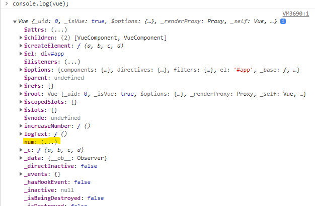

# 4-1 컴포넌트 통신
- 뷰 컴포넌트는 각각 고유한 데이터 유효 범위를 갖습니다.
- 컴포넌트 간에 데이터를 주고 받기 위한 방법으로 아래의 두개가 있습니다.
    - event : 하위에서 상위로는 이벤트를 올려줌
    - props : 상위에서 하위로는 데이터를 내려줌 


# 4-2 컴포넌트 통신 규칙이 필요한 이유
- 정해진 규칙으로만 데이터를 넘길 수 있기 때문에 데이터 추적이 쉬워진다.
- 데이터 추적이 쉬운 만큼 디버깅하기도 용이하다.

# 4-3 props 속성
상위 컴포넌트에서 하위 컴포넌트로 내려보내는 데이터 속성

## props 속성 코드 형식
- 하위 컴포넌트에 해당 코드 추가
```js
var childComponent = {
  props: ['프롭스 속성 명']
}
```
- 상위 컴포넌트의 템플릿에 해당 코드 추가
```html
<!-- 상위 컴포넌트의 템플릿 -->
<div id="app">
  <child-component v-bind:프롭스 속성 명="상위 컴포넌트의 data 속성"></child-component>
</div>
```
- './playground/05 props.html'의 예시 코드 참조
    - Vue DevTool에서 Root의 message가 AppHeader의 propsdata를 통해 전달되는 것을 볼 수 있다.
    .png)
    .png)

# 4-4 props 속성의 특징
- props로 전달될 데이터는 상위 컴포넌트에서 데이터 값이 변경되면 하위 컴포넌트에도 변경된 값이 전달 된다.
- 서로 다른 하위 컴포넌트의 props의 이름이 같아도 된다.
    - 각 props의 유효범위는 해당 하위 컴포넌트 내까지 이기 때문이다.

# 4-5 [실습 안내] props 속성 실습
- './playground/05 props.html'의 예시 코드 참조

# 4-6 [실습 풀이] props 속성 실습 풀이
- './playground/05 props.html'의 예시 코드 참조

# 4-7 event emit
하위 컴포넌트에서 상위 컴포넌트로 통신하는 방식

## event 발생 코드 형식
- 하위 컴포넌트의 메서드나 라이프 사이클 훅과 같은 곳에 이벤트가 발생하는 아래 코드 추가
```js
this.$emit('이벤트 명');
```
- 상위컴포넌트에 수신하기 위한 아래 코드 구현.
```html
<div id="app">
  <child-component v-on:이벤트 명="상위 컴포넌트의 실행할 메서드 명 또는 연산"></child-component>
</div>
```
- './playground/06 event-emit.html'의 예시 코드 참조
    - 하위 컴포넌트에서 발생한 이벤트를 상위 컴포넌트에서 수신한다.

# 4-8 event emit 으로 콘솔 출력하기
- Vue DevTool에서 event emit의 로그를 확인할 수 있다.


# 4-9 [실습 안내] event emit 실습 안내
- './playground/06 event-emit.html'의 예시 코드 참조

# 4-10 [실습 풀이] event emit 실습 풀이
- './playground/06 event-emit.html'의 예시 코드 참조

# 4-11 뷰 인스턴스에서의 this
- 객체 안의 `function()` 내의 this는 해당 객체를 가리킨다.
    - vue 인스턴스를 생성할 때 data에 해당하는 값들은 인스턴스의 속성이 된다.
    - vue 인스턴스를 생성할 때 methods의 함수들은 인스턴스의 메서드가 된다.
    - 그러므로 methods에 선언된 함수들의 this는 vue 인스턴스이므로 data에 선언된 값에 접근할 수 있다.
```js
//js 문법
var obj = {
    num : 10,
    logNum:function(){
        console.log(this.num);
    }
};

//vue 문법
new Vue({
    el: '',
    data : {
        num: 10,
    },
    methods: {
        getNumber: function(){
            console.log(this.num);
        }
    }
})
```

- JS에서 this 문법에 대해 알아두자.
- event emit 에서 매개변수로 값을 넘겨줄 수 있는 것도 추후 정리

