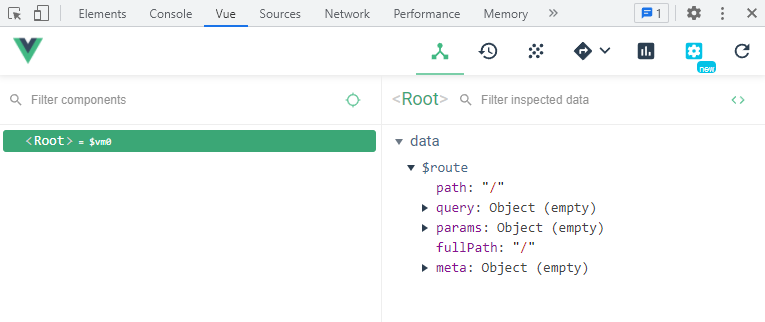
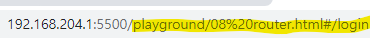
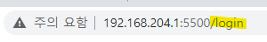
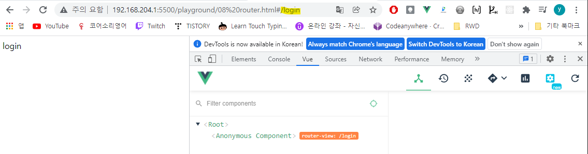
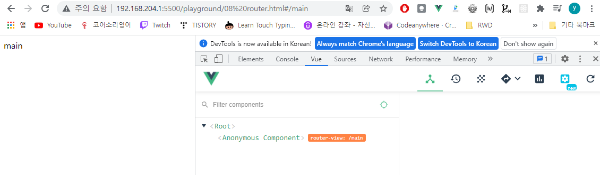
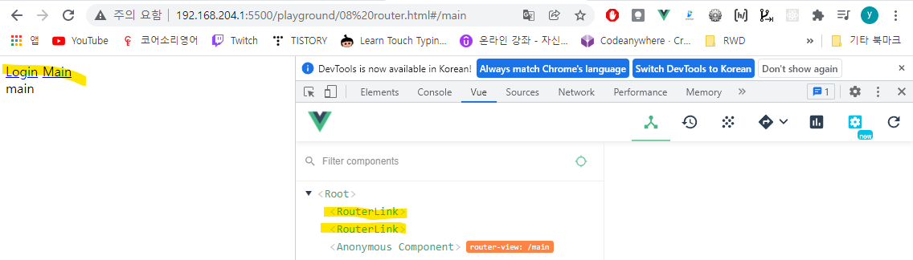

# 6-1 뷰 라우터 소개와 설치
- 페이지 이동과 관련된 라이브러리
- 뷰 라우터 공식 문서
    - https://router.vuejs.org/kr/installation.html


# 6-2 뷰 라우터 인스턴스 연결 및 초기 상태 안내

## 뷰 라우터 설치 방법
### CDN 방식
```html
<script src="https://unpkg.com/vue-router/dist/vue-router.js">
```
### NPM 방식
```sh
npm install vue-router
```



## 뷰 라우터 등록
- 라우터 인스턴스를 생성하여 뷰 인스턴스에 등록
```js
// 라우터 인스턴스 생성
var router = new VueRouter({
  // 라우터 옵션
})

// 인스턴스에 라우터 인스턴스를 등록
new Vue({
  router: router
})

```

# 6-3 [실습 안내] routes 속성 설명 및 실습 안내

## 라우터에 컴포넌트 등록
- routes 옵션 이용
    - url에 따라 어떤 컴포넌트가 출력되는지 등록한다.
```js
var LoginComponent = {
    template:'<div>login</div>',
};

var MainComponent = {
    template:'<div>main</div>',
}

var router = new VueRouter({
    //URL 이동 시 어떤 페이지가 출력되는지
    routes:[
        {
            //페이지의 url
            path: '/login',
            //해당 url에서 표시될 컴포넌트
            component : LoginComponent
        },
        {
            path:'/main',
            component : MainComponent
        }
    ]
});
```

## router URL의 해쉬값 제거
- mode : URL의 해쉬 값을 제거.
    - 간결한 URL을 제공해준다.
    
    

# 6-4 라우터가 표시되는 영역 및 router-view 태그 설명
- `<router-view>` : 특정 URL에 따라 컴포넌트가 출력되는 영역.
    - 브라우저의 주소 창에서 URL을 변경하으로써 출력되는 컴포넌트를 변경할 수 있다.
```html
<div id="app">
  <router-view></router-view> <!-- LoginComponent 또는 HomeComponent -->
</div>
```
- './playground/08 router.html' 예제 참조.




# 6-5 링크를 이용한 페이지 이동 및 router-link 태그 설명
- `<router-link>` : 링크를 생성하여 페이지를 이동할 수 있도록 해준다.
    - <a href=""> 형식으로 변환되어 출력된다.
    - `to` : 이동할 URL을 입력한다.(router에 등록된 URL)
    - 해당 링크를 클릭하면 to에 등록된 컴포넌트가 출력되도록 라우팅된다.
```html
<router-link to="이동할 URL"></router-link>
```

- './playground/08 router.html' 예제 참조.



- [tag명]*2 : 해당 tag를 2개 생성한다.


# 6-6 라우터 정리 및 학습 방향 안내
- 네비게이션 가드란? (추가 공부)
    - https://joshua1988.github.io/web-development/vuejs/vue-router-navigation-guards/


