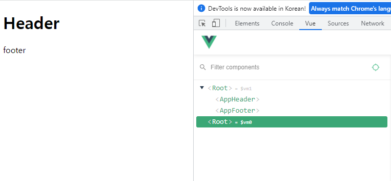

# 3-1 컴포넌트 소개
- 화면의 영역을 구분하여 코드 작성하는 개발하는 방법(컴포넌트 기반)
- 분리한 영역들을 컴포넌트라고 한다.
- 코드의 재사용성이 증가한다.

[컴포넌트](./img/component.png)

# 3-2 [실습 안애] 컴포넌트 등록 및 실습
- Vue 인스턴스가 Root 컴포넌트이다.

### 컴포넌트 생성 
```js
Vue.component('컴포넌트 이름', {
  // 컴포넌트 내용
});
```
- 실제 사용 예제는 `./playground/04 component.html`에서 확인 가능
- Vue에 등록된 컴포넌트들은 Vue 인스턴스의 시작점 tag 안에서 사용된다.

# 3-3 [실습 풀이] 전역 컴포넌트 등록
- Vue에 등록된 컴포넌트들은 Root 컴포넌트의 하위(자식)컴포넌트가 된다.
- Vue에 직접 등록된 컴포넌트들을 전역 컴포넌트라고 한다.
- 전역 컴포넌트는 실제 개발에는 잘 사용되지 않는다.
  - 플러그나 라이브러리 같은 전역으로 사용되는 것에만 이용

# 3-4 지역 컴포넌트 등록
```js
var vm = new Vue({
    el: '#app', 
    //지역 컴포넌트 등록 방식
    components : {
        //'컴포넌트 이름' : '컴포넌트 내용'
        'app-footer' : {
            template : '<footer>footer</footer>'
        }
    }
});
```
- 실제 사용 예제는 `./playground/04 component.html`에서 확인 가능


# 3-5 전역 컴포넌트와 지역 컴포넌트의 차이점
- 지역 컴포넌트 등록 방법을 이용하면 해당 컴포넌트에 어떤 컴포넌트가 이용되는지 한눈에 알기쉽다.


# 3-6 컴포넌트와 인스턴스와의 관계
- 인스턴스를 여러개 생성하면 그만큼의 <Root>가 생성된다.

- 전역 컴포넌트는 인스턴스를 생성할 때 따로 등록 없이도 사용이 가능하다.
- 지역 컴포넌트는 인스턴스에 등록하지 않으면 사용할 수 없다.


